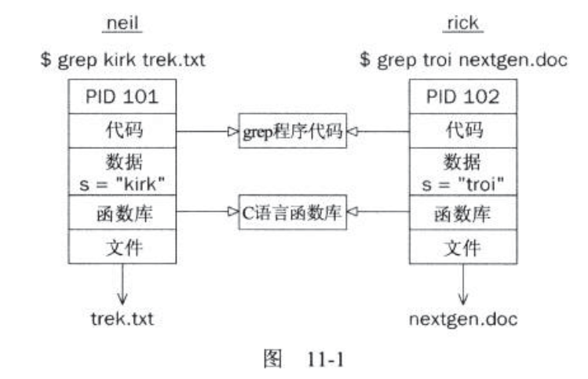
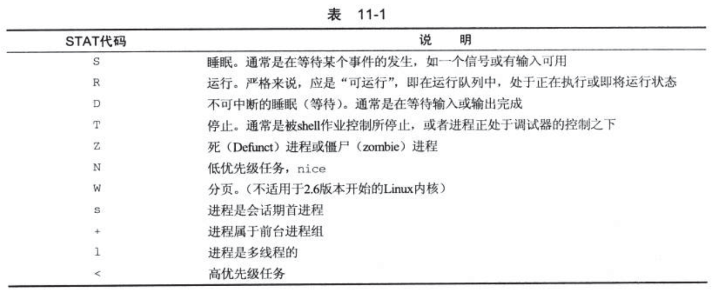
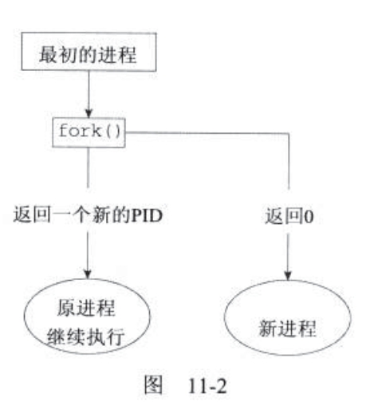
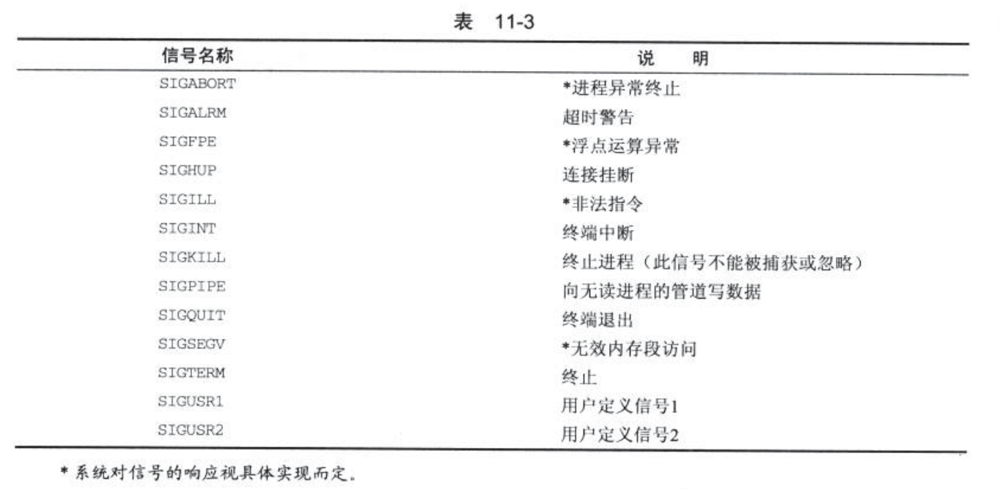
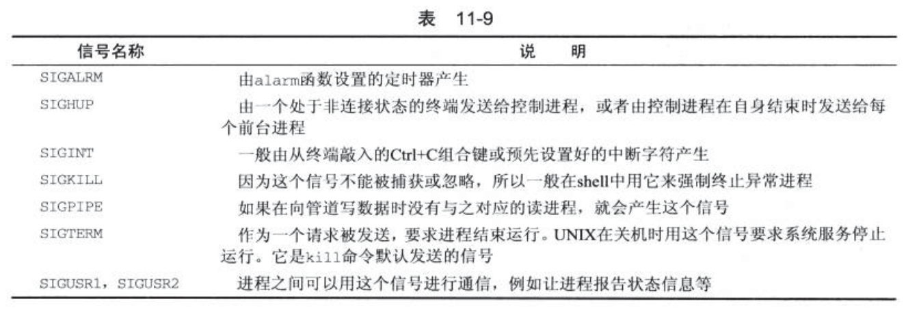

# Linux 程序设计 阅读笔记(三)

## 参考链接：

- [Linux内核文档首页](https://www.kernel.org/doc/Documentation/)
- [Linux文档](https://linux.die.net/)
- [Linux c 开发手册](https://legacy.gitbook.com/book/wizardforcel/linux-c-api-ref/details)
- [Linux Kernel API](https://www.kernel.org/doc/htmldocs/kernel-api/index.html)
- [书中代码地址](http://www.wrox.com/WileyCDA/WroxTitle/Beginning-Linux-Programming-4th-Edition.productCd-0470147628,descCd-DOWNLOAD.html)

## 第6章 使用curses函数库管理基于文本的屏幕

### 6.1 使用curses函数库进行编译

添加头文件`-I/usr/include/nucurses`,添加动态链接库`-lncurses`。

curses中输出字符的过程如下：

- 使用curses函数刷新逻辑屏幕。
- 要求curses使用refresh函数来刷新物理屏幕。

逻辑屏幕的布局通过一个字符数组来实现，它以屏幕的左上角为坐标原点。一般坐标表示(行，列)，y值在前、x值(列号)在后。


一个简单示例：

```c++

#include <unistd.h>
#include <stdlib.h>
#include <curses.h>

int main()
{
    //初始化屏幕

    initscr();
    //移动画笔位置
    move(5,15);

    printw("%s","Hello word");
    //刷新屏幕

    refresh();
    sleep(2);
    //结束窗口

    endwin();
    exit(EXIT_SUCCESS);
}
```
### 6.3 屏幕

使用`WINDOW *initscr(void)`进行窗口的初始化。这个函数在一个程序中只能调用一次。当结束窗口时就是使用`endwin()`函数进行相关资源的销毁，当函数成功时返回OK否则返回ERR。

#### 6.3.1 输出到屏幕

curses函数库提供了一些用于刷新屏幕的基本函数，它们是：


- `int addch(const chtype char_to_add)`:。
- `int addchstr(chtype  *const string_to_add)`:。
- `int printw(char* format,...)`:
- `int refresh(void)`
- `int box(WINDOW *win_ptr,chtype vertical_char,chtype horizontal_char)`
- `int insch(chtype char_to_insert)`：插入一个字符，将已有字符向右移动
- `int insertln(void)`
- `int delch(void)`
- `int delectln(void)`
- `int beep(void)`
- `int flash(void)`
- `int erase(void)`:清除屏幕，在每个屏幕位置写上空白字符。
- `int clear(void)`:调用erase后，再使用clearok来强制重现屏幕原文。彻底清除整个屏幕。
- `int clrtobot`函数清除当前光标位置直到屏幕结尾的所有内容。
- `int clrtobot`函数清除当前光标位置直到光标所处行位。
- `int move(int new_y,int new_x)`:将逻辑光标的位置移动到指定地点。希望变化立即显现使用`refresh`函数。
- `int leaveok(WINDOW *window_ptr,bool leave_flag)`；添加bool标志位，控制在屏幕刷新后curses刷新物理光标所放的位置。默认false，刷新后，硬件光标停留在屏幕上逻辑光标所处的位置。true,硬件光标会被随机地防止在屏幕的任意位置之上。

注意：curses拥有自己的字符类型chtype，比标准char类型包含跟多的二进制。

#### 6.3.5 字符属性

- `int attron(chtype attribute)`：启用指定的属性
- `int attroff(chtype attribute)`：关闭指定的属性
- `int attrset(chtype attribute)`:设置curses属性。
- `int standout(void)`:标准的输出
- `int standend(void)`:标准输出

### 6.4 键盘

设置键盘的相关函数

- `int echo(void)`：输出。
- `int noecho(void)`：。
- `int cbreak(void)`:
- `int raw(void)`:
- `int noraw(void)`:

#### 6.4.2 键盘输入

`int getch(void)`、`int getstr(char *string)`、`int getnstr(char* string,int number_of_characters)`、`int scanw(char *format,...)`。

### 6.5 窗口

#### 6.5.1 WINDOW窗口

使用`WINDOW * newwin(int num_of_lines,int num_of_cols,int start_y,int start_x)`来出那个键一个新窗口。`int delwin(WINDOW *window_to_delete)`删除一个窗口

注意：千万不要尝试删除curses自己的窗口和stdscr和curscr。

#### 6.5.3 移动和更新窗口

```c++
#include <curses.h>
int mvwin(WINDOW *window_to_move,int new_y,int new_x);
int wrefresh(WINDOW *window_ptr);
int wclear(WINDOW *window_ptr)
int werase(WINDOW *window_ptr);
int touchwin(WINDOW *window_ptr);
int scrollok(WINDOW *window_ptr,bool scroll_flag);
int scroll(WINDOW *window_ptr);
```

使用示例：

```c++
/*  As usual let's get our definitions sorted first.  */

#include <unistd.h>
#include <stdlib.h>
#include <curses.h>

int main()
{
    WINDOW *new_window_ptr;
    WINDOW *popup_window_ptr;
    int x_loop;
    int y_loop;
    char a_letter = 'a';
    //初始化显示

    initscr();

/*  Then we fill the base window with characters,
    refreshing the actual screen once the logical screen has been filled:

    move(5, 5);
    printw("%s", "Testing multiple windows");
    refresh();

    for (x_loop = 0; x_loop < COLS - 1; x_loop++) {
        for (y_loop = 0; y_loop < LINES - 1; y_loop++) {
            mvwaddch(stdscr, y_loop, x_loop, a_letter);
            a_letter++;
            if (a_letter > 'z') a_letter = 'a';
        }
    }

    refresh();
    sleep(2);
*/
/*  Now we create a new 10x20 window
    and add some text to it before drawing it on the screen.  */

    //创建新窗口

    new_window_ptr = newwin(10, 20, 5, 5);
    //移动窗口并进行写操作
    mvwprintw(new_window_ptr, 2, 2, "%s", "Hello World");

    mvwprintw(new_window_ptr, 5, 2, "%s", "Notice how very long lines wrap inside the window");
    //刷新窗口

    wrefresh(new_window_ptr);
    sleep(2);

/*  We now change the contents of the background window and, when we
refresh the screen, the window pointed to by new_window_ptr is obscured.  */

   a_letter = '0';
     for (x_loop = 0; x_loop < COLS - 1; x_loop++) {
        for (y_loop = 0; y_loop < LINES -1; y_loop++) {
            mvwaddch(stdscr, y_loop, x_loop, a_letter);
            a_letter++;
            if (a_letter > '9') a_letter = '0';
        }
    }

    refresh();
    sleep(2);

/*  If we make a call to refresh the new window, nothing will change,
    because we haven't changed the new window.  */

    wrefresh(new_window_ptr);
    sleep(2);

/*  But if we touch the window first
    and trick curses into thinking that the window has been changed.
    The next call to wrefresh will bring the new window to the front again.  */

    touchwin(new_window_ptr);
    wrefresh(new_window_ptr);
    sleep(2);

/*  Next, we add another overlapping window with a box around it.  */

    popup_window_ptr = newwin(10, 20, 8, 8);
    box(popup_window_ptr, '|', '-');
    mvwprintw(popup_window_ptr, 5, 2, "%s", "Pop Up Window!");
    wrefresh(popup_window_ptr);
    sleep(2);

/*  Then we fiddle with the new and pop-up windows before clearing and deleting them.  */

    touchwin(new_window_ptr);
    wrefresh(new_window_ptr);
    sleep(2);

    wclear(new_window_ptr);
    wrefresh(new_window_ptr);
    sleep(2);
    
    delwin(new_window_ptr);

    touchwin(popup_window_ptr);
    wrefresh(popup_window_ptr);
    sleep(2);
    
    delwin(popup_window_ptr);
    
    touchwin(stdscr);
    refresh();
    sleep(2);

    endwin();
    exit(EXIT_SUCCESS);
}

```

#### 6.5.4 优化屏幕刷新

- `int wnoutrefresh(WINDOW *window_ptr)`：把那些字符发送到屏幕上，实际的发送工作由dpupdate完成
- `int doupdate(void)`：可以进行相关数据的更新工作。
- `WINDOW *subwin(WINDOW *parent,int num_of_lines,int num_of_cols,int start_y,int start_x)`：创建子窗口

#### 6.4 keypad模式

使用`int keypad(WINDOW *window_ptr,bool keypad_on)`设置keypad_on为true来启用keypad模式。让curses接管按键转义序列的处理工作。读取用户按下的键，还将返回与逻辑按键对应的KEY_定义。

注意：识别escape转义序列的过程是与时间相关的，为了能够区分单独按下Escape按键和一个以Escape字符开头的键盘转义序列。不能处理二义性的escape转义序列。如果终端上两个而不同的按键会产生完全相同的专业序列，curses将不会处理这个转义序列，因为它不知道该返回哪个逻辑按键。

下面是简单的使用示例：

```c
#include <unistd.h>
#include <stdlib.h>
#include <curses.h>

#define LOCAL_ESCAPE_KEY    27

int main() 
{
    int key;

    initscr();
    crmode();
    keypad(stdscr, TRUE);

/*  Next, we must turn echo off
    to prevent the cursor being moved when some cursor keys are pressed.
    The screen is cleared and some text displayed.
    The program waits for each key stroke
    and, unless it's q, or produces an error, the key is printed.
    If the key strokes match one of the terminal's keypad sequences, 
    then that sequence is printed instead.  */
    //截断输出

    noecho();
    //清除

    clear();
    //移动输出

    mvprintw(5, 5, "Key pad demonstration. Press 'q' to quit");
    move(7, 5);
    //刷新

    refresh();
    //获取字符

    key = getch();
    while(key != ERR && key != 'q') {
        move(7, 5);
        clrtoeol();

        if ((key >= 'A' && key <= 'Z') ||
            (key >= 'a' && key <= 'z')) {
            printw("Key was %c", (char)key);
        }else {
            switch(key) {
            case LOCAL_ESCAPE_KEY: printw("%s", "Escape key"); break;
            case KEY_END: printw("%s", "END key"); break;
            case KEY_BEG: printw("%s", "BEGINNING key"); break;
            case KEY_RIGHT: printw("%s", "RIGHT key"); break;
            case KEY_LEFT: printw("%s", "LEFT key"); break;
            case KEY_UP: printw("%s", "UP key"); break;
            case KEY_DOWN: printw("%s", "DOWN key"); break;
            default: printw("Unmatched - %d", key); break;
            } /* switch */
        } /* else */

        refresh();
        key = getch();
    } /* end while */

    endwin();
    exit(EXIT_SUCCESS);
}

```

### 6.8 彩色显示

使用has_color()和start_color()可以实现对颜色例程的初始化。

```c++
#include <curses.h>
bool has_colors(void);
int start_color(void);

```
在将颜色作为属性使用之前，你必须首先调用`init_pair()`函数对准备使用的颜色组合进行初始化。对颜色属性的访问是通过COLOR_PAIR函数来完成的。

```c
#include <curses.h>

//定义颜色组合

int init_pair(short pair_number.short foreground,short background);
//

int COLOR_PAIT(int pair_number);
//获取已有的颜色组合

int pair_content(short pair_number,short *foreground,short *background);
//重定义色彩

int init_color(short color_number,short red,short green,short blue); 
```

颜色的调用示例：

```c

#include <unistd.h>
#include <stdlib.h>
#include <stdio.h>
#include <curses.h>

int main()
{
    int i;

    //初始化curses

    initscr();
    //检查是支持色彩的终端

    if (!has_colors()) {
        endwin();
        fprintf(stderr, "Error - no color support on this terminal\n");
        exit(1);
    }
    //初始化色彩选项

    if (start_color() != OK) {
        endwin();
        fprintf(stderr, "Error - could not initialize colors\n");
        exit(2);
    }

/*  We can now print out the allowed number of colors and color pairs.
    We create seven color pairs and display them one at a time.  */
    //清除屏幕

    clear();
    //输出文字

    mvprintw(5, 5, "There are %d COLORS, and %d COLOR_PAIRS available", 
             COLORS, COLOR_PAIRS);
    //进行刷新

    refresh();
    //初始化颜色

    init_pair(1, COLOR_RED, COLOR_BLACK);
    init_pair(2, COLOR_RED, COLOR_GREEN);
    init_pair(3, COLOR_GREEN, COLOR_RED);
    init_pair(4, COLOR_YELLOW, COLOR_BLUE);
    init_pair(5, COLOR_BLACK, COLOR_WHITE);
    init_pair(6, COLOR_MAGENTA, COLOR_BLUE);
    init_pair(7, COLOR_CYAN, COLOR_WHITE);
    //输出显色字符串

    for (i = 1; i <= 7; i++) {
        //开启属性设置

        attroff(A_BOLD);
        //设置颜色属性

        attrset(COLOR_PAIR(i));
        //输出文字

        mvprintw(5 + i, 5, "Color pair %d", i);
        //设置属性

        attrset(COLOR_PAIR(i) | A_BOLD);
        //输出文字

        mvprintw(5 + i, 25, "Bold color pair %d", i);
        //刷新

        refresh();
        //睡眠

        sleep(1);
    }

    endwin();
    exit(EXIT_SUCCESS);
}

```

### 6.9 pad
curses提供了特殊的数据结构pad来控制尺寸大于正常窗口的逻辑屏幕。相关接口如下;

```c
//初始化pad

WINDOW *newpad(int number_of_lines,int number_of_columns);
//执行刷新操作。指定放到屏幕上的pad范围和放置在屏幕上的位置。prefresh函数用于完成这一功能。


int prefresh(WINDOW *pad_ptr,
            int pad_row,
            int pad_column,
            int screen_row_min,//显示区域的坐标范文
            int screen_col_min,
            int screen_row_max,
            int screen_col_max
            )
```
pad的简单示例：

```c
#include <unistd.h>
#include <stdlib.h>
#include <curses.h>

int main() 
{
    WINDOW *pad_ptr;
    int x, y;
    int pad_lines;
    int pad_cols;
    char disp_char;

    initscr();

    pad_lines = LINES + 50;
    pad_cols = COLS + 50;
    //创建pad

    pad_ptr = newpad(pad_lines, pad_cols);

    disp_char = 'a';
    //在内部添加字符串

    for (x = 0; x < pad_lines; x++) {
        for (y = 0; y < pad_cols; y++) {
            mvwaddch(pad_ptr, x, y, disp_char);
            if (disp_char == 'z') disp_char = 'a';
            else disp_char++;
        }
    }

/*  We can now draw different areas of the pad on the screen at different locations before quitting.  */
    //更新局部窗口
    
    prefresh(pad_ptr, 5, 7, 2, 2, 9, 9);
    sleep(1);
    //更新大范围窗口

    prefresh(pad_ptr, LINES + 5, COLS + 7, 5, 5, 21, 19);
    sleep(1);

    delwin(pad_ptr);

    endwin();
    exit(EXIT_SUCCESS);
}

```

## 第七章 数据管理

本章中的主要内容
- 动态内存管理：可以做什么以及Linux不允许做什么。
- 文件锁定：协调锁、共享文件的锁定区域和避免死锁。
- dbm数据库：一个大多数linux系统都提供的、基本的、不基于SQL的数据库函数库。

### 7.1 

linux中的内存管理中一般情况下是265M的堆栈大小。linux中可以使用标准的c语言接口进行内存分配。注意当linux中的内存耗尽的时候，会linux内核会使用交换空间(独立的磁盘空间)。内核会在物理内存和交换空间之间移动数据和程序代码。
每个Linux系统中运行的程序都只能看到属于自己的内存映像，不同的程序看到的内存映像不同。只有操作系统知道物理内存是如何安排的。

Linux可以允许输出空指针，但是不允许空指针写入内存。

**linux中一旦程序调用free释放了一块内存，它就不再属于这个进程。它将由malloc函数库负责管理。在对一块内存调用free之后，就绝不能再对其进行读写操作了**

其它内存释放函数：

- `void *calloc(size_t number_of_elements,size_t element_size);`:结构数组分配内存，需要元素个数和每个元素的大小作为其参数。并且分配的内存全部初始化为0.返回数组中第一个元素的指针。
- `void *realloc(void *existing_memory,size_t new_size);`:释放内存。


### 7.2 文件锁定

文件锁与线程锁类似，都是使用锁来进行的。可以使用原子文件锁，来直接锁定文件，也可以只锁定文件的一部分，从而可以独享对这一部分内容的访问。

创建文件锁后，通常被放在一个特定的位置，linux中通常会在/var/spool目录中创建一个文件。
注意：**文件锁只是建议锁，不是强制锁**

可以贼打开文件时使用锁，想干参数在`fcnt.h`中，在此不做过多叙述。第三章中函数有详细叙述。

文件读取使用fread时，将整个文件都读取到了内存中，再传递给程序，文件内容中未被锁定的部分。当其它部分被更改后，内容锁消失；但是因为程序获取的还是fread上次读取的内容，因此会产生数据的错误。可以使用`read()`和`write()`读取部分内容，避免这个问题的发生。

下面是一个简单的读写锁示例

```c
#include <unistd.h>
#include <stdlib.h>
#include <stdio.h>
#include <fcntl.h>

const char *test_file = "/tmp/test_lock";

int main() {
    int file_desc;
    int byte_count;
    char *byte_to_write = "A";
    struct flock region_1;
    struct flock region_2;
    int res;

        /* open a file descriptor */

    file_desc = open(test_file, O_RDWR | O_CREAT, 0666);
    if (!file_desc) {
        fprintf(stderr, "Unable to open %s for read/write\n", test_file);
        exit(EXIT_FAILURE);
    }

        /* put some data in the file */

    for(byte_count = 0; byte_count < 100; byte_count++) {
        (void)write(file_desc, byte_to_write, 1);
    }

        /* setup region 1, a shared lock, from bytes 10 -> 30 */

    region_1.l_type = F_RDLCK;
    region_1.l_whence = SEEK_SET;
    region_1.l_start = 10;
    region_1.l_len = 20; 
    
        /* setup region 2, an exclusive lock, from bytes 40 -> 50 */

    region_2.l_type = F_WRLCK;
    region_2.l_whence = SEEK_SET;
    region_2.l_start = 40;
    region_2.l_len = 10;

        /* now lock the file */

    printf("Process %d locking file\n", getpid());
    res = fcntl(file_desc, F_SETLK, &region_1);
    if (res == -1) fprintf(stderr, "Failed to lock region 1\n");
    res = fcntl(file_desc, F_SETLK, &region_2);
    if (res == -1) fprintf(stderr, "Failed to lock region 2\n");    

        /* and wait for a while */
        
    sleep(60);

    printf("Process %d closing file\n", getpid());    
    close(file_desc);
    exit(EXIT_SUCCESS);
}
```

下图显示了当程序开始等待时文件锁定的状态


#### 7.2.5 其它锁命令

使用lockf函数。通过文件描述符进行操作

```c
#include <unistd.h>
int lockf(int filds,int function ,off_t size_to_lock);
```
function参数取值如下：

- F_ULOCK:解锁
- F_LOCK:设置独占锁
- F_TLOCK:测试并设置独占锁
- F_TEST:特使其它进程设置的锁

size_to_clock参数是操作的字节数，它从文件的当前偏移值开始计算。

### 7.3 数据库

#### 7.3.1 abm数据库

这里主要介绍dbm数据库，这个是linux中数据库自带的基本的版本。其基本文件包含在`ndbm.h`中可以使用`-I/usr/include/gdbm -lgdbm`参数进行链接。

#### 7.3.3 dbm访问函数

```c
#include <ndbm.h>
//打开数据库

DBM *dbm_open(const char* filename,int file_open_flags,mode_t file_mode);
//存储数据库

int dbm_store(DBM *database_descriptor,datum key, datum content ,int store_mode );
//数据库查询函数

datum dbm_fetch(DBM *database_descriptor,datum key);
//关闭数据库

datum dbm_close(DBM *database_descriptor);
```
其它操作函数

```c
//删除数据库

int dbm_delete(DBM *database_descriptor,datum key);
//测试数据库错误

int dbm_error(DBM *database_descriptor);
//清除数据库中所有以被置位的错误条件标志

int dbm_clearerr(DBM *database_descriptor);
//获取第一个关键数据
int dbm_firstkey(DBM *database_descriptor);
//获取第二个关键数据

int dbm_nextkey(DBM *database_descriptor);

```
## 第 八 章 MySQL

### MySQL安装

参考连接:
- [Ubuntu 16.04 mysql安装配置](https://www.jianshu.com/p/3111290b87f4)
- [Ubuntu18.04 安装MySQL](https://blog.csdn.net/weixx3/article/details/80782479)

可以从官网下载，也可以直接使用`sudo apt-get install mysql-server`进行安装。

安装完成后使用`sudo mysql_secure_installation`命令进行初始化设置。

再使用`sudo mysql -uroot -p`进行登录。`use database`使用数据库。

具体的请参考mysql对应文章。

### 8.3 使用c语言访问mysql

使用样例：

```c
#include <stdlib.h>
#include <stdio.h>

#include "mysql.h"

MYSQL my_connection;
MYSQL_RES *res_ptr;
MYSQL_ROW sqlrow;

int main(int argc, char *argv[]) {
   int res;

   mysql_init(&my_connection);  
   if (mysql_real_connect(&my_connection, "localhost", "rick", 
                                              "secret", "foo", 0, NULL, 0)) {
   printf("Connection success\n");
   
   res = mysql_query(&my_connection, "SELECT childno, fname, age FROM children WHERE age > 5");

   if (res) {
      printf("SELECT error: %s\n", mysql_error(&my_connection));
   } else {
      res_ptr = mysql_store_result(&my_connection);
      if (res_ptr) {
       printf("Retrieved %lu rows\n", (unsigned long)mysql_num_rows(res_ptr));
       while ((sqlrow = mysql_fetch_row(res_ptr))) {
         printf("Fetched data...\n");
       }
       if (mysql_errno(&my_connection)) {
         fprintf(stderr, "Retrive error: %s\n", mysql_error(&my_connection)); 
       }
       mysql_free_result(res_ptr);
      }

   }
   mysql_close(&my_connection);

   } else {
      fprintf(stderr, "Connection failed\n");
      if (mysql_errno(&my_connection)) {
         fprintf(stderr, "Connection error %d: %s\n",
                  mysql_errno(&my_connection), mysql_error(&my_connection));
      }
   }

   return EXIT_SUCCESS;
}
```

## 第 9 章 开发工具

### 9.2 make命令和makefile

make 选项参数：

- -k:make发生错误时仍然继续执行。
- -n:马克输出将要执行的操作而不进行执行。
- -f:使用那个文件作为makefile文件。

具体参看makefile相关文章

- [跟我一起写makefile](https://wangpengcheng.github.io/2019/07/06/write_makefile_with_me/)

### 9.3 源代码控制

- SCCS:源代码控制系统。
- RCS：版本控制系统。
- CVS：并发版本控制系统。


## 第 10 章 调试

### 10.1 错误类型

- 功能定义错误:程序的功能被错误的定义了。
- 设计规划错误：程序设计需要多花时间进行思考。
- 代码编写错误：代码编写过程中的错误。

### 10.2 常用调试技巧

- 测试：找出程序中存在的缺陷或者错误
- 固化：让程序的错误可重现
- 定位：确定相关的代码行
- 纠正：修改代码纠正错误
- 验证：确定修改解决了问题。

### 10.3 使用gdb进行调试

参考链接:

- [Linux环境下的GDB调试方法](https://blog.csdn.net/horotororensu/article/details/82256832)
- [Linux下gdb的安装及使用入门](https://www.cnblogs.com/chenmingjun/p/8280889.html)

重要指令和相关操作

- `gdb project_name (-tui)`:启动gdb(gui形式)
- `help`:显示帮助信息
- `run`:程序开始运行。
- `backtrace`:栈跟踪。
- `print value_name`:输出变量的值。
- `list`:列出源代码
- `breakpoint`:设置断点。
- `display array[0]@5`,显示连续的数据项。
- `info display`：获取显示信息。
- `info break`:显示断点信息。


### 10.4 其它调试工具

- `splint`:工具可以提供有用的代码审查注释。
- `ctags`：为程序中的所有函数创建索引。
- `cxref`：分析c语言源代码并生成一个交叉引用表。
- `cflow`：打印出一个函数调用树。
- `prof/gprof`产生执行存档


使用`assert(int expression)`对表达式进行求值，如果结果非零，就向标准错误写一些诊断信息，然后调用abort函数结束程序的运行。

```c++
#include <assert.h>
void assert(int expression);
```
**注意：assert中的宏受NDEBUG的影响，存在这个宏定义时会关闭断言功能**

### 10.6 内存调试

在一个已经分配的内存块的尾部的后面(或者在它头部的前面)写数据，就可能会破坏malloc库用于记录内存分配情况的数据结构。

使用ElectricFence函数库可以使用Linux的虚拟内存保护机制来保护malloc和free所使用的内存。

### 10.6.2 valgrind

这个是一个工具，有能力检测出前面讨论中的很多问题。

## 第 11 章 进程和信号

进程：一个其中运行着一个或者多个线程的地址空间和这些线程所需要的系统资源。进程是操作系统进行资源分配的最小单元。

两个用户同时运行相同程序的进程资源分布图



使用`ps -ef`指令进行进程表的查询。

使用`ps ax`进行现在运行进程的状态查询。

下面是stat状态码



在Linux中执行期短的突发性任务比持续占用处理器来进行计算或者不断轮训系统来查看是否有新的输入达到的程序要更好。这个是是进程优先级的重要因素。称为nice,一个进程的nice值默认为0并将根据这个程序的表现而不断变化。长期不剪短运行的程序的优先级一般会比较低。这样可以帮助与用户进行呼叫的程序保持及时的响应。

可以使用`ps -l`查看linux进程中的nice值。

### 11.3 启动新进程

#### 11.3.1 替换进程映像

```c
#include <stdlib.h>

int system(const char *string);
```
system运行以字符串参数的形式传递给它的命令，并等待命令的完成。命令的执行情况就如同下面的情况`sh -c string`。

注意：这里system函数并不是启动气他进程的理想手段，应为它必须用一个shell来启动需要的程序。

可以优先使用`exec`系列函数。

exec函数可以把当前进程替换为一个新进程，新进程由path或者file参数指定。可以使用exec函数将程序的执行从一个程序切换到另外一个程序。exec函数比system函数更有效，因为在新的程序启动后，原来的程序就不再运行了。

```c++
#include <unistd.h>
char **environ;
//参数可变函数

int execl(const char *path,const char *arg0,...,(char*)0);
int execlp(const char *file,const char *arg0,...,(char*)0);
int execle(const char *path,const chat *arg0,...,(char*)0,char *const envp[]);
//参数不可变函数。

int execv(const char *path,char *const argv[]);
int execvp(const char *file,char *const argv[]);
int execve(const char *path,char *const argv[],char *const envp[]);
```

注意：使用exec函数相当于直接进行了进程的切换，因此在exec函数之后的都不会进行。

#### 11.3.2 复制进程映像

可以使用线程或者从源程序中创建一个全分离的进程，后者就想init的做法一样，而不想exec调用那样用新程序替换当前执行的线程。可以使用fork创建一个新进程。

```c
#include <sys/type.h>
#include <unistd.h>

pid_t fork(void);
```


一个简单的fork示例：

```c

#include <sys/types.h>
#include <unistd.h>
#include <stdio.h>
#include <stdlib.h>

int main()
{
    pid_t pid;
    char *message;
    int n;
    printf("fork pogram starting\n");
    pid=fork();
    switcg(pid){
        case -1:
            perror("fork failed");
            exit(1);
        case 0:
            message="This is the child";
            n=5;
            break;
        default:
            message="This is the parent";
            n=3;
            break;
    }
    for(;n>0;--n){
        puts(message);
        sleep(1);
    }
    exit(0);
}
```

子进程被创建并且输出消息5次。原进程(即父进程)，只输出消息3次。具体结果如下

```shell
fork program starting
This is the parent
This is the child
This is the parent
This is the child
This is the parent
This is the child
This is the child
This is the child
```

#### 等待一个进程

当使用fork启动以这个子进程时，子进程就有了它自己的声明周期并将独立运行。可以在父进程中调用`wait()`函数让父进程等待子进程的结束。

```c
#include <sys/types.h>
#include <sys/wait.h>

pid_t wait(int *stat_loc);
//等待特定进程
pid_t waitpid(pid_t pid,int *stat_loc,int options);
```

wait系统调用将暂停父进程直到它的子进程结束为止，这个调用返回子进程的PID。


```

if(pid!=0){
    int stat_val;
    pid_t child_pid;
    child_pid=wait(&stat_val);
    printf("child has finished:PID =%d\n",childe_pid);
    if(WIFEXITED(stat_val))
        printf("Child exited with code %d\n",WEXITSTATUS(stat_val));
    else
        printf("Childe terminated abnormally \n");
}
```

#### 僵尸进程

当子进程终结时，它与父进程之间的关联还会保持，直到父进程也正常终止或者父进程调用wait才结束，在这段时间内，虽然子进程已经不再运行，但它仍然存在于系统中，因为它的退出码还需要保存起来，以备父进程今后的wait调用使用。这时称其为一个死(defunct)进程或者僵尸进程。

#### 11.3.4 线程

线程可以共享内存段。但从本质上来说，它们是操作系统内各自独立的实体。

### 11.4 信号

linux中由(raise)表示一个信号的产生，使用术语(catch)表示接收到一个信号。信号的名称在头文件`signal.h`中定义的。它们以SIG开头



如果进程接收到这些信号中的一个，但事先没有安排捕获它，进程将会立刻终止。**系统将生成核心转储存文件core**,并将其放在当前目录下。该文件是进程在内存中的映像，它对程序的调试很有用处。


相关函数
```c
#include <signal.h>

void (*signal(int sig, void((*func)(int))))(int);
```
注意:这里并不推荐使用`signal()`接口，建议使用`sigaction()`函数。

#### 11.4.1 发送信号

```c
#include <sys/types.h>
#include <signal.h>
int kill(pid_t pid,int sig);

//使用闹钟设置指定时间后运行
unsigned int alarm(unsigned int seconds);

```
kill函数将参数sig给定的信号发送给由参数pid给出的进程号所指定的进程，成功时返回0。错误时返回-1并设置errno变量。其类型如下：

- EINVAL:给定的信号无效。
- EPERM:发送进程权限不够。
- ESRCH:目标进程不存在。

信号接受使用pause(),将一个程序的执行挂起直到有一个信号出现位置。当程序接收到一个信号时，预先设置好的信号处理函数将开始运行。程序也将恢复正常的执行。

```c
#include <unistd.h>
int pause(void);
```

**一个简装的信号接口**

```c
#include <signal.h>
int sigaction(int sig,const struct sigaction *act,struct sigaction *oact);
```
sigaction结构定义在接收到参数sig指定的信号后应该采取的行动。该结构至少应该包括以下几个成员：

```c
void (*) (int) sa_handler  //函数指针
sigset_t sa_mask //指定了信号集
int sa_flags //对信号处理重置的效果，必须在sa_flags成员中包含值SA_RESETHAND
```

#### 11.4.2 信号集

```c
#include <signal.h>

//将信号集中添加信号

int sigaddset(sigset_t *set,int signo);
//将信号集初始化为空

int sigemptyset(sigset_t *set);
//sigfillset将信号集初始化为包含所有已定义的信号。

int sigfillset(sigset_t *set);
//从信号集中删除信号

int sigdelset(sigset_t *set,int signo);
//判断一个给定的信号是否是一个信号集的成员。如果是就返回1，不是返回0，信号无效就返回-1并设置errno
int sigismember(sigset_t *set,int signo);
//信号屏蔽字的设置和检查

int sigprocmask(int how,const sigset_t *set,sigset_t *oset);
//将被阻塞的信号中停留在待处理状态的一组信号写到参数set指向的信号集合中。进程挂起自己的执行，直到信号集中的一个信号到达为止。

int sigpending(sigset_t *set);
//将进程的屏蔽字替换为由参数sigmask给出的信号集，然后挂起程序的执行。

int sigsuspend(const sigset_t *sigmask);

```


sigprocmask中how的取值如下


**sigaction标志**


**Linux常用信号参考**



引起信号异常终止信号：


接收之后挂起的信号


下面信号是重启被暂停的进程


