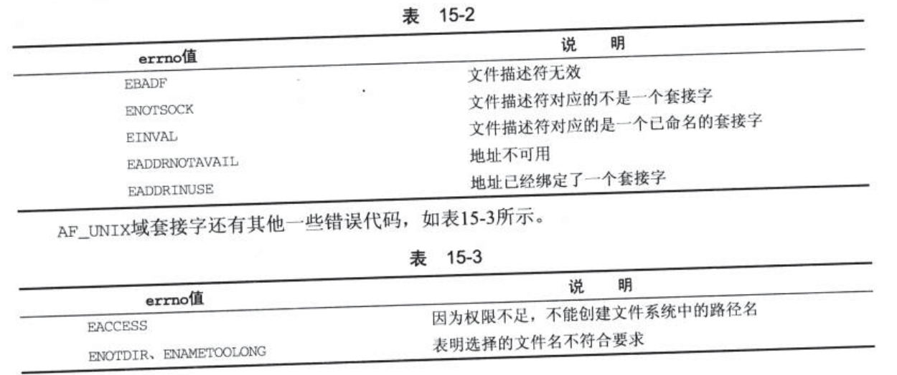

> 2019-09-23: 16:48:53

# Linux 程序设计 阅读笔记(五)

## 参考链接：

- [Linux内核文档首页](https://www.kernel.org/doc/Documentation/)
- [Linux文档](https://linux.die.net/)
- [Linux c 开发手册](https://legacy.gitbook.com/book/wizardforcel/linux-c-api-ref/details)
- [Linux Kernel API](https://www.kernel.org/doc/htmldocs/kernel-api/index.html)
- [书中代码地址](http://www.wrox.com/WileyCDA/WroxTitle/Beginning-Linux-Programming-4th-Edition.productCd-0470147628,descCd-DOWNLOAD.html)
- [POSIX thread (pthread) libraries](https://www.cs.cmu.edu/afs/cs/academic/class/15492-f07/www/pthreads.html)

## 第 15 章 套接字(socket)

socket是管道概念的一个廓镇。使用与管道类似的方法来使用套接字，套接字中还包括了计算机网络中的通信。
本章主要内容：

- 套接字链接的工作原理
- 套接字的属性、地址和通信
- 网络信息和互联网守护进程(inetf/xinetd)
- 客户和服务器

### 15.1 什么是套接字

套接字(socket)是一种通信机制，客户端/服务器系统的开发工作既可以在本地进行，也可以跨网络进行。socket明确的将客户端与服务器区分开来，这也是socket区别于管道通信的地方。

### 15.2 socket连接

1. 服务器应用程序用系统调用socket来创建一个socket套接字。它是系统分配个该服务器进程的类似文件描述符的资源，不能与其它进行共享。
2. 服务器会给socket起一个名字，本地socket名称是Linux文件系统中的文件名。一般放在/tmp或者/usr/tmp目录中。Linux将进入的特定端口号的连接转接到正确的拂去其进程。服务器系统使用bind来给套接字命名，然后服务器进程就开始等待客户连接到命名套接字。系统使用listen创建一个队列并将其用于存放来自客户端的接入连接。条用accept来接受客户端的连接。
3. 服务器调用accept时，新建一个与特定客户端相关的新的套接字来方便通信。

下面是一个简单的本地客户端

```c
/*  Make the necessary includes and set up the variables.  */

#include <sys/types.h>

#include <sys/socket.h>

#include <stdio.h>

#include <sys/un.h>

#include <unistd.h>

#include <stdlib.h>

int main()
{
    //声明sockfd文件描述索引

    int sockfd;
    int len;
    //声明地址

    struct sockaddr_un address;
    int result;
    char ch = 'A';
    //创建socket

    sockfd = socket(AF_UNIX, SOCK_STREAM, 0);

    //设置socket名称，作为服务器请求和答应

    address.sun_family = AF_UNIX;
    strcpy(address.sun_path, "server_socket");
    len = sizeof(address);
    //将我们的套接字连接到服务器的套接字上

    result = connect(sockfd, (struct sockaddr *)&address, len);

    if(result == -1) {
        perror("oops: client1");
        exit(1);
    }
    //通过sockfd进行读写
    write(sockfd, &ch, 1);
    read(sockfd, &ch, 1);
    //输出获取的信息

    printf("char from server = %c\n", ch);
    //关闭连接

    close(sockfd);
    exit(0);
}

```

**server1.c服务器创建**

```c
/*  Make the necessary includes and set up the variables.  */

#include <sys/types.h>

#include <sys/socket.h>

#include <stdio.h>

#include <sys/un.h>

#include <unistd.h>

#include <stdlib.h>

int main()
{
    int server_sockfd, client_sockfd;
    int server_len, client_len;
    //服务器address

    struct sockaddr_un server_address;
    //客户端地址

    struct sockaddr_un client_address;
    //这里删除以前的套接字，为服务器创建一个未命名的套接字

    unlink("server_socket");

    server_sockfd = socket(AF_UNIX, SOCK_STREAM, 0);
    //对套接字进行命名

    server_address.sun_family = AF_UNIX;
    strcpy(server_address.sun_path, "server_socket");
    server_len = sizeof(server_address);
    bind(server_sockfd, (struct sockaddr *)&server_address, server_len);
    //创建一个连接队列，开始等待客户进行连接

    listen(server_sockfd, 5);
    //循环等待

    while(1) {
        char ch;
        printf("server waiting\n");
        //获取client长度

        client_len = sizeof(client_address);
        //接收一个client客户端请求，并产生一个套接字文件

        client_sockfd = accept(server_sockfd,(struct sockaddr *)&client_address, &client_len);
        //client_sockfd套接字上的客户端进行读写操作。

        read(client_sockfd, &ch, 1);
        ch++;
        write(client_sockfd, &ch, 1);
        //关闭客户端连接

        close(client_sockfd);
    }
}
```
使用如下命令在启动客户端和服务器`./server1 &` 和`./clinet1`。输出结果如下：

```bash
server waiting
char from server = B

```
注意用完一个套接字后，就应该把它删除掉，即使是在程序因接受到一个信号而异常终止的情况下。

#### 15.2.1 套接字(socket)属性

socket的主要属性如下：

1. 域(domain):指定socket通信中使用的网络介质。常见的套接字域是`AF_INET`，表示Internet网络协议。其底层的协议--网际协议(IP)只有一个地址族。常用服务端口号通常小于1024,有:打印机缓冲队列进程(515)、rlogin(513)、ftp(21)和httpd(80)等。小鱼1024的端口都是为系统服务保留的。并且所有服务的进程必须具有超级用户权限。在netdb.h中定义了一个常量`IPPORT_RESERVED`，代表保留端口号的最大值。也可以使用`AF_UNIX`表示UNIX文件系统域
2. 类型(type):因为Internet网中提供了两种不同的通信机制:流(stream)和数据报(datagram)，因此这里也提供了两种截然不同的套接字类型。
   1. 流套接字:提供一个有序、可靠、双向字节流的连接。发送出去的数据可以确保不会丢失、复制或者乱序到达。错误不会被显示。主要由`SOCK_STREAM`指定，在AF_INET域中，通过TCP/IP连接实现。
   2. 数据报套接字：由`SOCK_DGRAM`指定，不建立和维持一个连接。数据报长度有限制，数据报作为一个单独的网络消息被传输。存在错误。主要由UDP/IP连接实现的。但是开销小。不需要维持网络连接。速度较快。
3. 协议(protocol):底层传输机制，允许不止一个协议来提供要求的套接字类型。


#### 15.2.2 创建套接字

```c
#include <sys/types.h>

#include <sys/socket.h>

int socket(int domain,int type,int protocol);
```
`domain`指定协议族(INET/UNIX)，type参数指定通信类型(SOCK_STREAM/SOCK_DGRAM);protocol指定协议类型

domain参数可以指定的协议族如下：


#### 15.2.3 套接字地址

`AF_UNIX`地址结构由`sockaddr_un`来描述，该结构定义子啊头文件`sys/un.h`中

```c
struct sockaddr_un
  {
    sa_family_t sun_family;
    /* Path name.  */

    char sun_path[];
  };
//下面是Ubuntu16.04 中的相关定义

struct sockaddr_un
  {
    __SOCKADDR_COMMON (sun_);
    /* Path name.  */

    char sun_path[108];
  };
```

如上所示Linux规定长度是108个字符。

在`AF_INET`中，地址结构由`sockaddr_in`来指定，该结构定义在头文件`netinet/in.h`中，它至少包括以下几项：

```c
struct sockaddr_in{
    short int           sin_family;     /*AF_INET*/
    unsigned short int  sin_port;       /*Port number*/
    struct in_addr      sin_addr;       /*Internet address*/
}
```
ip地址结构定义如下:

```c
typedef uint32_t in_addr_t;
struct in_addr
  {
    in_addr_t s_addr;
  };
```

#### 15.2.4 命名套接字

使用bind函数可以让创建的套接字可以被其它进程使用，服务器程序必须给套接字命名。这样`AF_UNIX`套接字就会关联到一个文件系统的路径名。AF_INET就会关联到一个IP端口号。

```c
#include <sys/socket.h>

int bind(int socket,const struct sockaddr *address,size_t address_len);
```
bind将address中的地址分配给与文件描述符socket关联的未命名套接字。地址长度由address_len传递。

**地址的长度和格式取决于地址族**，然后bind调用一个特定的地址结构指针转换为指向通用的地址类型(struct sockaddr*);调用成功返回0，失败返回-1，并设置errno为表15-2中的一个值



#### 15.2.5 创建套接字队列

服务器程序必须创建一个队列来保存未处理的请求。使用`listen`系统调用来完成这项工作。
```c
int listen(int socket,int backlog)
```

backlog设置接收队列长度的值。Linux系统中也对可以容纳的未处理连接的最大数目做出限制。多出的连接将被拒绝。常用参数值是5。

#### 15.2.6 接受连接

服务器通过accept接受来自客户的等待队列的事件处理和连接:

```c
int accept(int socket,struct sockaddr *address,size_t *address_len);
```

accept只有当排队的第一个未处理程序，试图连接到由socket参数指定的套接字上时才返回。accept函数将创建一个新套接字来与该客户进行通信，并返回新套接字的描述符。新套接字的类型和服务器监听套接字类型是一样的。

**注意：套接字必须事先bind调用命名，并且由listen调用分配给它一个连接队列。** 连接客户段的之地将被放入address参数指向的sockaddr结构中。也可以将其指定为空。

参数address_len指定客户地址结构的长度，超过则会被截断。因此address_len必须被设置为预期的地址长度。当调用返回时，长度会被设置成客户地址结构的实际长度。

如果等待队列为空，贼accept将会阻塞(程序将暂停)直到有客户建立连接为止。我们可以通过对套接字文件描述符设置`O_NONBLOCK`标志来改变这个行为。

```c
int flags=fcntl(socket,F_GETFL,0);
fcntl(socket,F_SETFL,O_NONBLOCK|flags);
```

当有未处理的客户连接时，accept函数将返回一个新的套接字文件描述符。发生错误时返回-1，`O_NONBLOCK`对应`EWOULDBLOCK`错误，后者是当进程阻塞在accept调用时，执行被中断而产生的错误。

#### 15.2.7 请求连接


