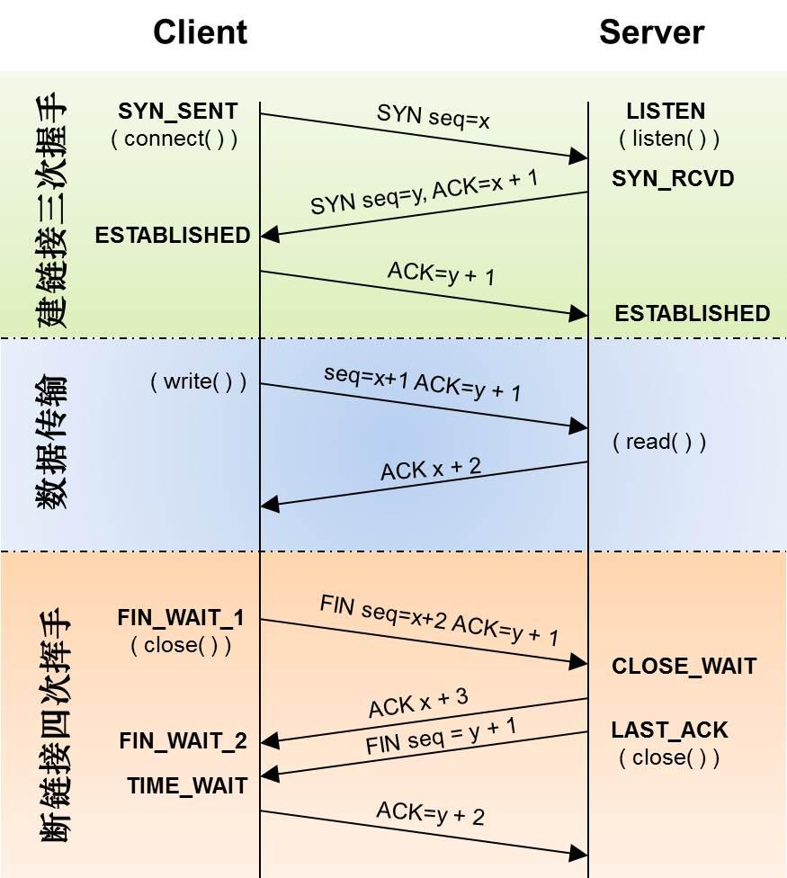

# 问答项目讲述

1. 讲一下你的项目和中间遇到的问题

之前做过一个无人驾驶远程控制的项目；主要有路径规划与控制；实时定位与地图重建，视频传输与目标检测。这几个部分；我主要做的是视频传输和目标检测；其中视频传输是之前的主要工作内容；大体上分为三个部分：集中显示和控制客户端，车载电脑的视频流传输服务端，数据存储中心。，客户端使用C++的是Qt进行GUI界面的编写，利用QtLocation加载离线的地图瓦片和实时显示自动驾驶车辆的位置；使用ffmpeg播放车载电脑的监控。另外因为远程监控的实时性要求特别高，因此自己写了一个基于mjpg流的，C++视频传输服务器；相对于ffmpeg的H264和H256视频rtsp流；传输时延从2s降低到了0.5s。

下面先说一下MJPG流媒体服务端把。服务器端主要分为三个部分，Linux使用Linux 的v4l2摄像头YUV数据图像读取，libjpeg和cuda图像格式的转换和压缩编码(这里可能会问jpeg编码)；HTTP的图像数据传输。

使用一个全局变量存储图像缓冲，和服务器状态和访问互斥量以及信号量，使用互斥访问量和信号量来实现几个线程之间的同步(这里可能会问C++中线程的同步和互斥；几种内存序，锁的种类);

TCP链接,使用epoll进行socket套接字的监听;(这里会问socket)。使用创建使用为read和wirte进行socket的读写(为什么要使用read和write),为每一个建立链接的客户端建立一个响应线程，根据它的HTTP请求(这里会问HTTP的东西)，建立线程池，使用loop用来定义工作的函数，并且给每一个Thread分配一个loop;发送对应的回应。如果请求的是一个stream流，就进入循环中。持续获取buffer中的数据，并封装成HTTP帧进行传输。对于错误的请求按照状态码进行回应。在请求buffer。如果写入失败就中断链接

中间在做这个的时候，为了保证实时性，遇到了很多问题，因为使用的MJPE压缩，因此发送的图片非常大，需要的带宽大致是1-2M/s,因此当网络状态较差时会出现卡帧的情况，或者帧延迟(这里可能会问网络拥塞)。减少buffer的缓冲队列的大小；同时更改前台的请求方式，由stream请求更改为循环的，单次图片请求，队列中一般值存储当前的2-3帧图像，取消写入的buffer，减少缓冲(为什么read需要缓冲)。从4G网络更换到校园局域网；使用cuda进行YUV到RGB的图像颜色通道的转换增加速度。

# 可能提问

1. 为什么使用MJPG：

H265和H264使用

2. 说一下C++中锁的种类

- a. 互斥锁（Mutex):std::mutex some_mutex;只有一个线程可以获得锁；使用std::lock_guard<std::mutex>或者std::lock<std::mutex>
- b. 条件锁:std::condition_variable;只和std::mutex一起工作;data_cond.notify_one();和data_cond.wait(lk,{[]return !data_queue.empty();});进行条件判断和继续
- c. 自旋锁:C++中没有自旋锁；可以自己实现
- d. 读写锁:
- e. 递归锁std::recursive_mutex；线程占有 recursive_mutex 时，若其他所有线程试图要求 recursive_mutex 的所有权，则它们将阻塞（对于调用 lock ）或收到 false 返回值（对于调用 try_lock ）。所谓递归锁，就是在同一线程上该锁是可重入的，对于不同线程则相当于普通的互斥锁。

3. C++中的6中内存序：

- a. std::memory_order_relaxed；没有顺序一致性的要求，也就是说同一个线程的原子操作还是按照happens-before关系，但不同线程间的执行关系是任意。
- b. std::memory_order_consume：这个内存序是“获取-释放”的一部分，它依赖于数据，可以展示线程间的先行关系。a->b->c 顺序执行
- c. std::memory_order_acquire:内存一致性;这个是以牺牲优化效率，来保证指令的顺序一致执行，相当于不打开编译器优化指令，按照正常的指令序执行(happens-before)，多线程各原子操作也会Synchronized-with;读操作需要在“一个写操作对所有处理器可见”的时候才能读，适用于基于缓存的体系结构。
- d. std::memory_order_release:最后简单说下栅栏吧，栅栏相当于给内存加了一层栅栏，约束内存乱序。典型用法是和 relaxed一起使用。保证栅栏的前后有序。
- e. std::memory_order_acq_rel:获取-释放一致性；这个是对relaxed的加强，relax序由于无法限制多线程间的排序，所以引入synchronized-with，但并不一定意味着，统一的操作顺序
- f. std::memory_order_seq_cst:

3. 为甚没有使用future
因为future主要使用在异步中，这边的实时性要求非常高，使用future主要是和async实现异步。与其使用future来进行等待buffer的缓冲，不如直接使用条件锁，进行发送。

future主要的异步函数的配合：

stl中:
thread
async和feature 启动一个异步线程,返回一个结果
std::launch::async, 创建线程异步
std::launch::deferred: 不创建线程
feature.get(): 等待并取值
feature.wait(): 等待

promise:
std::promise 类模板，我们能够在某个线程中给它赋值，然后我们可以在其他线程中把这个值取出来用;
通过promise保存一个值，在将来某时刻我们通过把一个future绑定到这个promise上来得到这个绑定的值。
promise.set_value(): 设置值
promise.get_future(): 将promise和feature相关联, 以供异步调用

packaged_task
std::packaged_task是个模板类，它的模板参数是各种可调用对象；
通过std::packaged_task来把各种可调用对象包装起来，方便将来作为线程入口函数来调用。
packaged_task包装起来的可调用对象还可以直接调用，所以从这个角度来讲，packaged_task对象，也是一个可调用对
还可以通过packaged_task.get_feature和feature进行关联, 以实现异步调用

4. 为什么使用条件锁std::condition_variable

因为视频传输的帧率也就是是20~30帧之间，甚至15帧，相对帧间的间隔比较大，使用条件锁进行通知就可以了。

5. 为什么没有使用原子操作作为缓冲区的访问锁

因为读写缓冲区是一个系列的操作，需要的是一段临界代码，使用原子操作代码复杂性太高，并且对于多个线程进行访问时，数据的争用反而会降低效率。

6. jpeg的编码问题

使用libjpeg进行图像的编码：
（1） 块准备：块准备将一帧图象分成数据块。

（2） DCT变换：通过函数进行映射，变成对应的系数块
（3）量化：使用线性量化，将相似的进行压缩；为了达到压缩的目的，DCT系数需作量化，量化表针对的设计。例如，例如，利用人眼的视觉特性，对在图象中占有较大能量的低频成分，赋予较小的量化间隔和较少的比特表示，以获得较高的压缩比。对于近似值进行合并
（4）DCT直流值和AC交流系数的编码：使用AC稀疏矩阵来记录矩阵中为0值的点。
（5）熵编码(哈夫曼编码)：对于上面给出的码序列，再进行统计特性的熵编码。这仅对于序列中每个符号对中的第一个字节进行，第二个幅值字节不作编码，仍然直接传送。
（6） 图像质量，输入参数确定图像质量

– FDCT

– 使用加权函数对变换系数量化，加权函数根据人的视觉系统确定。

– 编码顺序Zigzag：使系数为0的值更集中。

– 使用DPCM对直流系数编码

– 使用RLE对交流系数进行编码

– Huffman 熵编码。

libjpeg对应流程：
1. 创建 jpeg_decompress_struct(jpeg_create_decompress)；jpeg_error_mgr(jpeg_std_error)结构体并进行初始化-> jpeg_stdio_src绑定错误流->设置宽高，质量等压缩参数-> jpeg_start_decompress(启动解压)；循环调用jpeg_read_scanlines复制压缩后的数据到缓冲区->变量销毁jpeg_finish_decompress，jpeg_destroy_decompress。

7. 说一下haffuman编码

哈夫曼编码，主要目的是根据使用频率来最大化节省字符（编码）的存储空间。使用哈夫曼树来对数据进行编码，哈夫曼树是一个二叉树，其中左代表0，右代表1。数据在其叶子节点，根节点到叶子节点的路径01序列，就是它的编码值。

8. YUV转与GRB的相互转换
Y =  0.299*R + 0.587*G + 0.114*B;

U = -0.169*R - 0.331*G + 0.5  *B ;

V =  0.5  *R - 0.419*G - 0.081*B;

R = Y + 1.4075 * (V-128);  
G = Y - 0.3455 * (U-128) - 0.7169*(V-128);  
B = Y + 1.779 * (U-128);  

9. 介绍一下YUV
YUV是一种颜色编码方式：Y是灰阶值，U和V是影像色彩和饱和度。
YUV 4:4:4采样，每一个Y对应一组UV分量；
YUV 4:2:2采样，每两个Y共用一组UV分量。
YUV 4:2:0采样，每四个Y共用一组UV分量。

此外还有YUV422P，YV12，YU12等数据格式

# 网络编程可能会问道的问题：

1. 说一下TCP的三次握手和四次挥手

- 第一次握手：建立连接。客户端发送连接请求报文段，将SYN 位置为1，Sequence Number 为x；然后，客户端进入SYN_SEND 状态，等待服务器的确认；
- 第二次握手：服务器收到SYN 报文段。服务器收到客户端的SYN 报文段，需要对这个SYN 报文段进行确认，设置Acknowledgment Number 为x+1(Sequence Number+1)；同时，自己自己还要发送SYN 请求信息，将SYN 位置为1，Sequence Number 为y；服务器端将上述所有信息放到一个报文段（即SYN+ACK 报文段）中，一并发送给客户端，此时服务器进入SYN_RECV 状态；
- 第三次握手：客户端收到服务器的SYN+ACK 报文段。然后将Acknowledgment Number设置为y+1，向服务器发送ACK 报文段，这个报文段发送完毕以后，客户端和服务器端都进入ESTABLISHED 状态，完成TCP 三次握手。
- 四次挥手
- 当客户端和服务器通过三次握手建立了TCP 连接以后，当数据传送完毕，肯定是要断开TCP 连接的啊。那对于TCP 的断开连接，这里就有了神秘的“四次分手”。
- 第一次分手：主机1（可以使客户端，也可以是服务器端），设置Sequence Number和Acknowledgment Number，向主机2 发送一个FIN 报文段；此时，主机1 进入FIN_WAIT_1 状态；这表示主机1 没有数据要发送给主机2 了；
- 第二次分手：主机2 收到了主机1 发送的FIN 报文段，向主机1 回一个ACK 报文段，Acknowledgment Number 为Sequence Number 加1；主机1 进入FIN_WAIT_2 状态；主机2 告诉主机1，我“同意”你的关闭请求；
- 第三次分手：主机2 向主机1 发送FIN 报文段，请求关闭连接，同时主机2 进入LAST_ACK 状态；
- 第四次分手：主机1 收到主机2 发送的FIN 报文段，向主机2 发送ACK 报文段，然后主机1 进入TIME_WAIT 状态；主机2 收到主机1 的ACK 报文段以后，就关闭连接；此时，主机1 等待2MSL 后依然没有收到回复，则证明Server 端已正常关闭，那好，主机1 也可以关闭连接了。
- 六大标志位
    - SYN，同步标志位；
    - ACK 确认标志位；
    - PSH 传送标志位；
    - FIN 结束标志位；
    - RST 重置标志位；
    - URG 紧急标志位；
- seq 序号；
- ack 确认号

3. TCP 为啥挥手要比握手多一次？

- 因为当处于LISTEN 状态的服务器端收到来自客户端的SYN 报文(客户端希望新建一个TCP 连接)时，它可以把ACK(确认应答)和SYN(同步序号)放在同一个报文里来发送给客户端。
- 但在关闭TCP 连接时，当收到对方的FIN 报文时，对方仅仅表示对方已经没有数据发送给你了，但是你自己可能还有数据需要发送给对方，则等你发送完剩余的数据给对方之后，再发送FIN 报文给对方来表示你数据已经发送完毕，并请求关闭连接，所以通常情况下，这里的ACK 报文和FIN 报文都是分开发送的。

4. 为什么一定进行三次握手？

- 当客户端向服务器端发送一个连接请求时，由于某种原因长时间驻留在网络节点中，无法达到服务器端，由于TCP 的超时重传机制，当客户端在特定的时间内没有收到服务器端的确认应答信息，则会重新向服务器端发送连接请求，且该连接请求得到服务器端的响应并正常建立连接，进而传输数据，当数据传输完毕，并释放了此次TCP 连接。
- 若此时第一次发送的连接请求报文段延迟了一段时间后，到达了服务器端，本来这是一个早已失效的报文段，但是服务器端收到该连接请求后误以为客户端又发出了一次新的连接请求，于是服务器端向客户端发出确认应答报文段，并同意建立连接。
- 如果没有采用三次握手建立连接，由于服务器端发送了确认应答信息，则表示新的连接已成功建立，但是客户端此时并没有向服务器端发出任何连接请求，因此客户端忽略服务器端的确认应答报文，更不会向服务器端传输数据。而服务器端却认为新的连接已经建立了，并在一直等待客户端发送数据，这样服务器端一直处于等待接收数据，直到超出计数器的设定值，则认为服务器端出现异常，并且关闭这个连接。在这个等待的过程中，浪费服务器的资源。
- 如果采用三次握手，客户端就不会向服务器发出确认应答消息，服务器端由于没有收到客户端的确认应答信息，从而判定客户端并没有请求建立连接，从而不建立该连接。

5. 说一说HTTP

6. 说一说TCP的拥塞控制和流量控制

- 慢开始
    - 发送方维持一个叫做拥塞窗口`cwnd(congestion window`)的状态变量。
    - 拥塞窗口的大小取决于网络的拥塞程度，并且动态地在变化。
    - 发送方让自己的发送窗口等于拥塞窗口，另外考虑到接受方的接收能力，发送窗口可能小于拥塞窗口。
    - 慢开始算法的思路就是，不要一开始就发送大量的数据，先探测一下网络的拥塞程度，也就是说由小到大逐渐增加拥塞窗口的大小。
    - 当然收到单个确认但此确认多个数据报的时候就加相应的数值。
    - 所以一次传输轮次之后拥塞窗口就加倍。
    - 这就是乘法增长，和后面的拥塞避免算法的加法增长比较。
    - 为了防止cwnd 增长过大引起网络拥塞，还需设置一个慢开始门限ssthresh状态变量。
    - ssthresh 的用法如下：
    - 当cwnd<ssthresh 时，使用慢开始算法。
    - 当cwnd>ssthresh 时，改用拥塞避免算法。
    - 当cwnd=ssthresh 时，慢开始与拥塞避免算法任意。
    - 拥塞避免算法让拥塞窗口缓慢增长，即每经过一个往返时间RTT 就把发送方的拥塞窗口cwnd 加1，而不是加倍。
    - 这样拥塞窗口按线性规律缓慢增长。无论是在慢开始阶段还是在拥塞避免阶段，只要发送方判断网络出现拥塞(其根据就是没有收到确认，虽然没有收到确认可能是其他原因的分组丢失，但是因为无法判定，所以都当做拥塞来处理)，就把慢开始门限设置为出现拥塞时的发送窗口大小的一半。
- 然后把拥塞窗口设置为1，执行慢开始算法。
- 如下图：

- 快重传和快恢复
    - 快重传要求接收方在收到一个失序的报文段后就立即发出重复确认（为的是使发送方及早知道有报文段没有到达对方）而不要等到自己发送数据时捎带确认。
    - 快重传算法规定，发送方只要一连收到三个重复确认就应当立即重传对方尚未收到的报文段，而不必继续等待设置的重传计时器时间到期。
- 快重传配合使用的还有快恢复算法，有以下两个要点:
    - 当发送方连续收到三个重复确认时，就执行“乘法减小”算法，把ssthresh门限减半。但是接下去并不执行慢开始算法。
    - 考虑到如果网络出现拥塞的话就不会收到好几个重复的确认，所以发送方现在认为网络可能没有出现拥塞。所以此时不执行慢开始算法，而是将cwnd 设置为ssthresh 的大小，然后执行拥塞避免算法。
- 如下图：

7. TCP 可靠性保证
- 序号
    - `TCP` 首部的序号字段用来保证数据能有序提交给应用层，`TCP` 把数据看成无结构的有序的字节流。
    - 数据流中的每一个字节都编上一个序号字段的值是指本报文段所发送的数据的第一个字节序号。
- 确认
    - `TCP` 首部的确认号是期望收到对方的下一个报文段的数据的第一个字节的序号；
- 重传
    - 超时重传
    - 冗余`ACK` 重传
- 流量控制
    - `TCP` 采用大小可变的滑动窗口进行流量控制，窗口大小的单位是字节。
    - 发送窗口在连接建立时由双方商定。
    - 但在通信的过程中，接收端可根据自己的资源情况，随时动态地调整对方的发送窗口上限值(可增大或减小)。
- 窗口
    - 接受窗口`rwnd`，接收端缓冲区大小。接收端将此窗口值放在`TCP` 报文的首部中的窗口字段，传送给发送端。
    - 拥塞窗口`cwnd`，发送缓冲区大小。
    - 发送窗口`swnd`, 发送窗口的上限值 = `Min [rwnd, cwnd]`
- 拥塞控制
- 流量控制与拥塞控制的区别
    - 所谓拥塞控制就是防止过多的数据注入到网络中，这样可以使网络中的路由器或链路不致过载。
    - 拥塞控制所要做的都有一个前提，就是网络能承受现有的网络负荷。
    - 流量控制往往指的是点对点通信量的控制，是个端到端的问题。
    - 流量控制所要做的就是控制发送端发送数据的速率，以便使接收端来得及接受。

8. 说一下SOKCET 编程的主要流程

TCP 过程：
客户端：
1) 创建socket
2) 绑定ip、端口号到socket 字
3) 连接服务器，connect()
4) 收发数据，send()、recv()
5) 关闭连接
服务器端：
1) 创建socket 字
2) 设置socket 属性
3) 绑定ip 与端口号
4) 开启监听，listen()
5) 接受发送端的连接accept()
6) 收发数据send()、recv()
7) 关闭网络连接
8) 关闭监听

9. HTTP状态吗

1) 1XX 信息码，服务器收到请求，需要请求者继续执行操作；
2) 2XX 成功码，操作被成功接收并处理；
3) 3XX 重定向，需要进一步的操作以完成请求；
4) 4XX 客户端错误，请求包含语法错误或无法完成请求；
5) 5XX 服务器错误，服务器在处理请求的过程中发生了错误404 服务器无法根据客户端的请求找到资源（网页）。通过此代码，网站设计人员可设置"您所请求的资源无法找到"的个性页面

10. 你实现了那几个HTTP的状态码？
- 200 ok传输正常
- 401 
- 404 找不到文件请求
- 400 请求参数错误
- 500 服务器错误
- 501 Not Implemented

11. 说一下HTTP的请求方式

OPTIONS：返回服务器针对特定资源所支持的HTTP请求方法。也可以利用向Web服务器发送'*'的请求来测试服务器的功能性。 
HEAD：向服务器索要与GET请求相一致的响应，只不过响应体将不会被返回。这一方法可以在不必传输整个响应内容的情况下，就可以获取包含在响应消息头中的元信息。 
GET：向特定的资源发出请求。 
POST：向指定资源提交数据进行处理请求（例如提交表单或者上传文件）。数据被包含在请求体中。POST请求可能会导致新的资源的创建和/或已有资源的修改。 
PUT：向指定资源位置上传其最新内容。 
DELETE：请求服务器删除Request-URI所标识的资源。 
TRACE：回显服务器收到的请求，主要用于测试或诊断。 

12. 为什么使用的水平模式而非边缘模式

- 水平模式:只要socket缓冲区有数据，且执行了EPOLL_CTL_ADD监听socket，内核就一直通知进程；即，只要内核通知了进程，但是进程没有read或者没有read完数据，就会触发唤醒进程。
- 边缘模式（ET）:socket有数据，会通知进程，不管进程有没有read，后续不再通知。
但是一种情况例外，就是唤醒进程不read或者read部分数据之后，如果有再次调用了 EPOLL_CTL_MOD 添加EPOLLIN事件的情况，则该进程还是会被再次唤醒。

书中的解释是，et唤醒次数少，但要求反复读取直到eagain，系统调用次数更多，总体上不一定比lt快。此外lt的代码实现可能会略简单一些。gejun提到过，在极端critical的情况下，如果epoll wait和读取被分散到了不同的线程，此时lt会导致epoll陷入busy loop，所以必须用et。

不会丢失数据或者消息。对于追求低延迟的程序来说，这么做是高效的；实现简单；照顾了每个连接的公平性。不会因为某个连接上数据量过大而影响其他连接处理消息，采用LT延迟低。而且边缘模式，必须使用非阻塞IO;并要一次性全部读写完数据。

1. 一分钟的自我介绍

您好，我是王鹏程；现在正在四川大学就读研究生二年级;主要的研究方向是数字图像处理和计算机视觉；研究生阶段主要使用语言是c++，之前主要的项目是老师所带领的一个校园无人公交车的项目；我主要在里面负责车辆监控客户端和摄像头图像传输服务器，以及实时的深度学习目标检测网络;所有软件代码在Nvidia Jetson TX2 上的集成和整合。现在主要是在实现深度学习目标检测网络的推理加速和异构计算设备的支持。