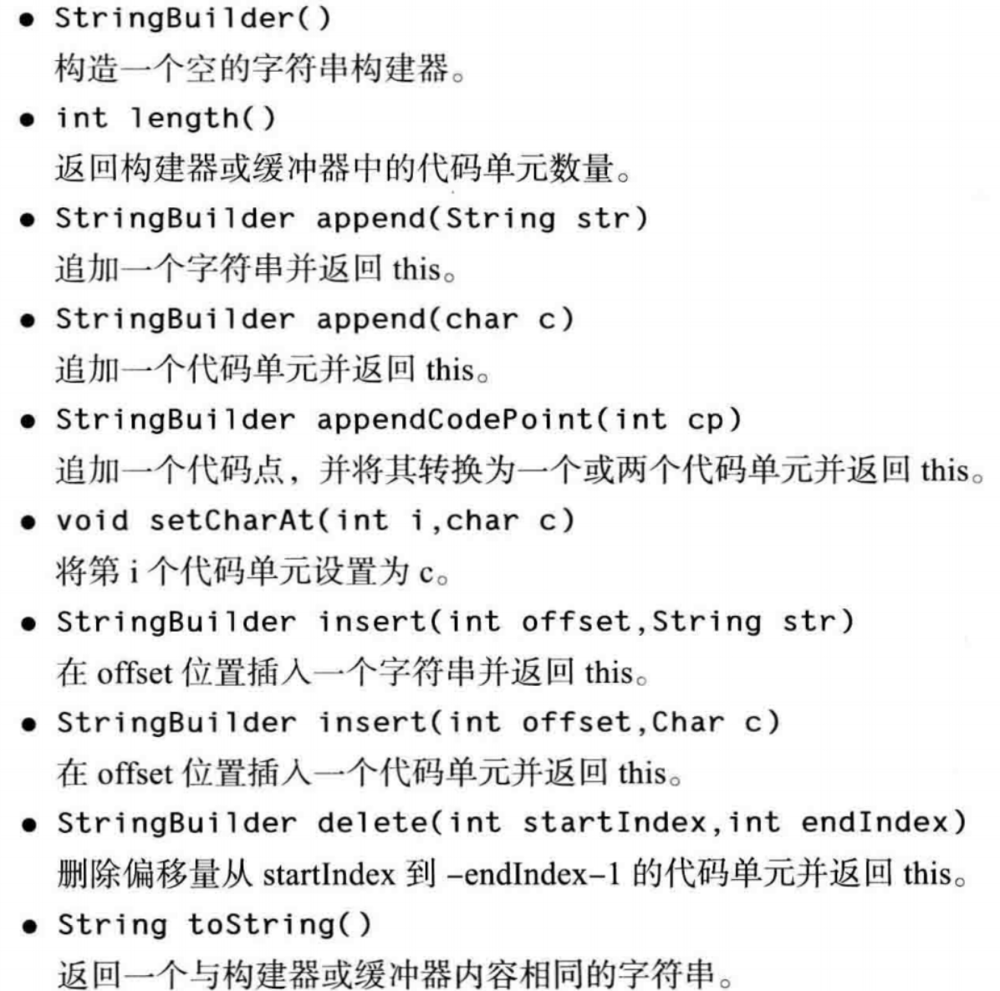
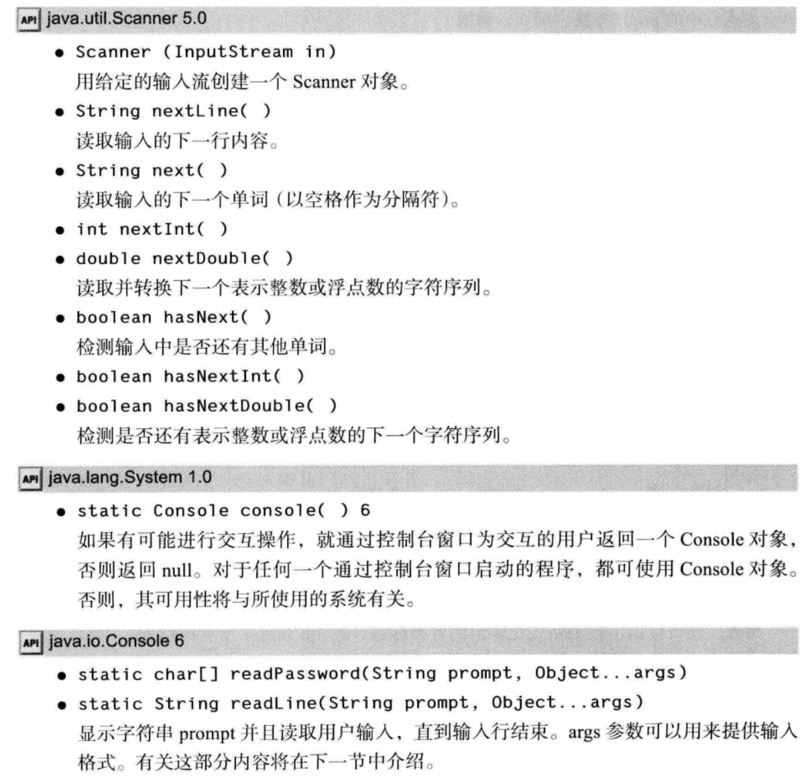
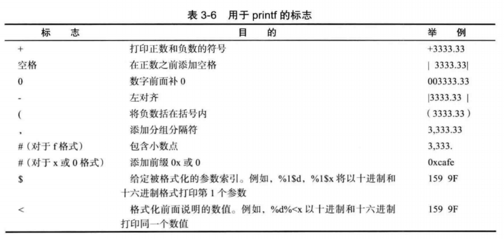
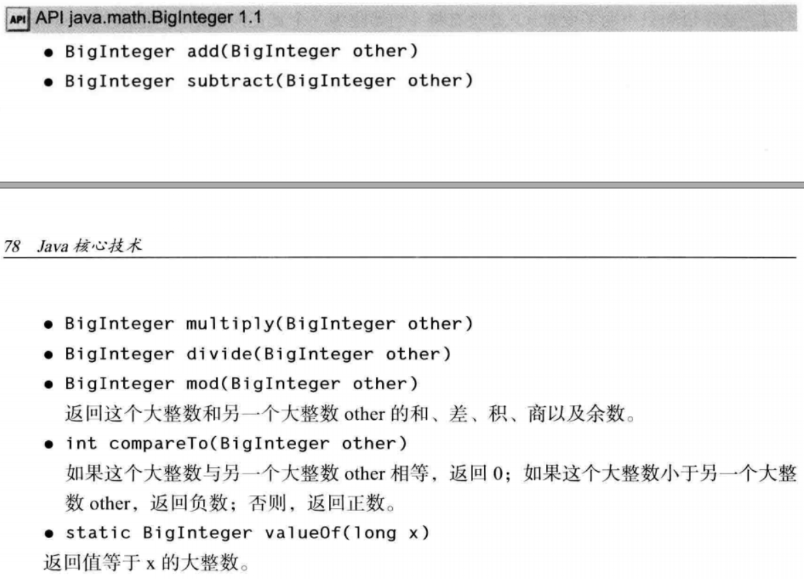

---
layout:     post
title:      Java核心编程 卷I 笔记(一)
subtitle:   Java核心编程 卷I 笔记(一)
date:       2020-05-08
author:     王鹏程
header-img: img/post-bg-ios10.jpg
catalog: true
tags:
    - Java
    - 基础编程
    - 读书笔记
---

> 2020-05-08 19:40:58

_参考链接：_
- [Java中文手册](https://www.matools.com/api/java8)

# 第一章 Java程序设计概述

## 1.2 Java 白皮书的关键术语
1. 简单性
2. 面向对象
3. 分布式
4. 健壮性
5. 安全性
6. 体系结构中立
7. 可移植性
8. 解释型
9. 高性能
10. 多线程
11. 动态性

# 第二章 Java程序设计环境

## 2.1 安装Java开发包工具

Java开发包工具可以到[Orcale官网](https://www.oracle.com/java/technologies/javase-downloads.html)进行下载；但是因为Orcale的下载机制；因此需要注册用户。可以使用该[网站](http://bugmenot.com/view/oracle.com)获取账户和密码进行下载。

注意：
- 安装JDK之后，需要设置PATH添加JDK/bin路径和CLASSPATH路径；方便进行相关环境变量的设置
- CLASSPATH中需要添加.路径。否则JAVA无法查找当前文件下的.class文件。

### 2.1.3 SRC源码

可以在JDK中找到标准库的源码；是src.zip的一个压缩文件。进行解压缩之后就可以获得源码。

### 2.1.4 下载本书源码示例
可以从如下链接查找和下载本书的源代码

- [源码地址](http://horstmann.com/corejava/)

## 2.2 使用命令行工具简单的编译源码

创建如下源代码Welcome.java：
```java
/**
* This file is a simple example for java 
* @version 1.30 2020-05-11
* @author WangPengCheng
*/
public class Welcome
{
    public static void main (String [] args)
    {
        //创建字符串常量
        String greeting ="Welcome to Core Java";
        System.out.println(greeting);
        for(int i=0;i<greeting.length();++i)
        {
            System.out.print("=");
        }
        System.out.println();
    }

}
```
执行下面的命令可以编译和运行；并产生结果

```shell
javac Welcome.java
java Welcome
Welcome to Core Java!
=====================
```
注意:
- Java的大小写敏感，java的文件名必须和public中的class名相同
- java运行时直接使用.class文件名。不需要带.class后缀
- 对于`错误: 找不到或无法加载主类 Welcome.class`；需要检查设置的路径


## 2.3 使用集成开发环境

本书推荐eclipse作为集成开发工具。但是因为不能翻墙下载一些jar；使用IntelliJ IDEA作为替代。解决下载问题之后可以使用eclipse

## 2.4 运行图形化应用程序
图形化应用程序的主要代码如下:
```java
/* 导入相关的包和库 */
import java.awt.*;
import java.io.*;
import javax.swing.*;
/**
* A program for viewing images
* @version 1.30 2020-05-11 18:25:62
* @author WangPengCheng
*/

public class ImageViewer
{
    public static void main(String[] args)
    {
	//lambel表达式添加函数
        EventQueue.invokeLater(()->{
            JFrame frame=new ImageViewerFrame();
            frame.setTitle("ImageViewer");
            frame.setDefaultCloseOperation(JFrame.EXIT_ON_CLOSE);
            frame.setVisible(true);
        });
    }
}
/*
 显示图片帧
*/
class ImageViewerFrame extends JFrame
{
    private JLabel label;
    private JFileChooser chooser;
    private static final int DEFAULT_WIDTH=300;
    private static final int DEFAULT_HEIGHT=400;
    //定义构造函数
    public ImageViewerFrame()
    {
        setSize(DEFAULT_WIDTH,DEFAULT_HEIGHT);
        //使用显示图片
        label=new JLabel();
        add(label);
        //设置文件夹当前路径
        chooser=new JFileChooser();
        chooser.setCurrentDirectory(new File("."));

        //设置文件选择框
        JMenuBar menuBar=new JMenuBar();
        setJMenuBar(menuBar);
        JMenu menu=new JMenu("File");
        menuBar.add(menu);
        //设置选框按钮
        JMenuItem openItem = new JMenuItem("Open");;
        menu.add(openItem);
        openItem.addActionListener(event->{
            //显示 选择弹窗
            int result=chooser.showOpenDialog(null);
            //根据选择设置icon
            if(result==JFileChooser.APPROVE_OPTION)
            {
                String name=chooser.getSelectedFile().getPath();
                label.setIcon(new ImageIcon(name));
            }
        });
        //设置关闭弹窗
        JMenuItem exitItem=new JMenuItem("Exit");
        menu.add(exitItem);
        exitItem.addActionListener(even->System.exit(0));
    }
}
```

## 2.5 构建并运行applet
详见 RoadApplet示例

# 第三章  Java的基本程序设计结构

## 3.1 一个简单的Java应用程序

注意：
- Java大小写敏感
- Java中类必须以字母开头；但是不能使用保留字段；标准规范为以大写字母开头。单次的每一个首字母都应该大写
- 源代码的文件名必须与公共类的名字相同，并使用Java作为扩展名。

## 3.2 注释
_参考链接：_ 

java中的注释有三种`//`,`/**/`和`/** */` ；最后一种是文档注释；可以用来生成文档。
文档注释的关键字；如下:

|标签|描述|示例|
|:---|:---|:---|
|@author|标识一个类的作者|@author description|
|@deprecated|指名一个过期的类或成员|@deprecated description|
|{@docRoot}|指明当前文档根目录的路径|Directory Path|
|@exception|标志一个类抛出的异常|@exception exception-name explanation|
|{@inheritDoc}|从直接父类继承的注释|Inherits a comment from the immediate surperclass.|
|{@link}|插入一个到另一个主题的链接|{@link name text}|
|{@linkplain}|插入一个到另一个主题的链接，但是该链接显示纯文本字体|Inserts an in-line link to another topic.|
|@param|说明一个方法的参数|@param parameter-name explanation|
|@return|说明返回值类型|@return explanation|
|@see|指定一个到另一个主题的链接|@see anchor|
|@serial|说明一个序列化属性|@serial description|
|@serialData|说明通过writeObject( ) 和 writeExternal( )方法写的数据|@serialData description|
|@serialField|说明一个ObjectStreamField组件|@serialField name type description|
|@since|标记当引入一个特定的变化时|@since release|
|@throws|和 @exception标签一样.	|The @throws tag has the same meaning as the @exception tag.|
|{@value}|显示常量的值，该常量必须是static属性。|Displays the value of a constant, which must be a static field.|
|@version|指定类的版本|@version info|

## 3.3 数据类型

_参考链接：_ [Java基本数据类型](https://www.runoob.com/java/java-basic-datatypes.html)

Java中有两大数据类型:内置数据类型和引用数据类型
- 内置数据类型:

|数据类型|位数大小|最小值|最大值|默认值|
|:---|:---|:---|:---|:---|
|boolean|1|false|true|false|
|byte|8|127（2^7-1）|-128（-2^7）|0|
|char|16|`\u0000(0)`|`\uffff(65535)`|无|
|short|16|-32768（-2^15）|32767（2^15 - 1）|0|
|int|32|-2,147,483,648（-2^31）|2,147,483,647（2^31 - 1）|0|
|float|32|无|无|0.0f|
|long|64|-9,223,372,036,854,775,808（-2^63）|9,223,372,036,854,775,807（2^63 -1）|0L|
|double|64|无|无|0.0d|

注意：
- **声明变量可以。但进行使用时，必须初始化之后才能使用。**
- Java中不区分变量的声明和定义。
- 自动类型转换:**整型、实型（常量）、字符型数据可以混合运算。运算中，不同类型的数据先转化为同一类型，然后进行运算。**

> 低  ------------------------------------>  高
> 
> byte,short,char—> int —> long—> float —> double 

- 注意:
    1. 不能对boolean类型进行类型转换。
    2. 不能把对象类型转换成不相关类的对象。
    3. 在把容量大的类型转换为容量小的类型时必须使用强制类型转换。
    4. 转换过程中可能导致溢出或损失精度。

- 引用类型
    - 在Java中，引用类型的变量非常类似于C/C++中的指针。引用类型指向一个对象，指向对象的变量是引用变量；对象和数组都是引用数据类型。
    - 所有引用类型的默认值都是null
    - 一个引用变量可以用来引用任何与之兼容的类型
    
注意:
- 对象只有在实例化之后才能被使用，而实例化对象的关键字就是new。
- 对象的实例化过程如下:


- 常量:Java中利用关键字final指示常量。

## 3.5 运算符

Java中的使用`+,-,*,/`表示对应运算
注意:**整数被0除将会产生一个异常，而浮点数被0除将会得到无穷大结果(Infinity)**

### 3.5.1 数学函数与常量

Java中包含了各种各样的数学函数，一般使用Math开头。一般Math中的方法都是静态方法；Math中没有幂函数，需要借助pow方法，中的两个输入对象进行计算。

注意:java中的double类型不能用于金钱的运算，因为会存在误差。
当不想使用前缀时可以采取如下的办法:

```java
//将所有方法作为static类型使用
import static java.lang.Math.*;
System.out.println("The square root of \uo3co is"+sqrt(PI));
```
感想:Java基本上是按照C++的设计思路在进行改进。C++中使用namespace 实现方法的重复冲突解决。但是Java直接使用文件夹和package的方式来作为namespace；本质上是一样的，但是因为区分了static方法和变量。C++中的全局方法实际是static方法。

注意:
- 这里的`import static`。一般引入需要使用 ClassName.method(); 的方式去调用类中的静态方法；而静态引入后，直接使用 method(); 即可使用静态方法。
- Math类中，为了达到最快的性能，所有的方法都使用计算机浮点单元中的例程。如果想得到准确的结果，因该使用StrictMath类。

### 3.5.2 数值类型之间的转换

转换方式如图所示，一般是低精度向高精度转换。但是注意和C++不同，Java中的boolean类型，不能向其它类型进行转换。

### 3.5.7 位运算符

Java中的逻辑运算符和位运算符基本和C++相同，但是，为了避免右移运算时，C++使用最高符号位填充新高位。这里统一使用`>>>`使用0填充高位。消除了不确定性。

### 3.5.8 java中的运算符及其级别


### 3.6.3 不可变字符串

Java中的String类没有提供修改字符串的方法。每次的字符串修改，实际上都是新拷贝了一个字符串。原来的字符串仍旧存在于内存中。在jdk的实现中，string本质上是一个char数组；这里的char数组是被final修饰的。

### 3.6.4 检测字符串是否相同

因为Java不像C++可以重载==操作符，因此判断是否相同，需要使用equal函数或者compareTo()(结果为0时相同)函数。

- null是指String对象没有初始化，相当于char* temp=null;空串是其等于"";

### 3.6.6 码点与代码单元

_参考链接：_ [字符集和字符编码](https://blog.csdn.net/u012268339/article/details/54694310?utm_medium=distribute.pc_relevant.none-task-blog-BlogCommendFromMachineLearnPai2-2.nonecase&depth_1-utm_source=distribute.pc_relevant.none-task-blog-BlogCommendFromMachineLearnPai2-2.nonecase)

因为Java中使用Unicode字符集，编码方式通常为UTF-8或者UTF-16等不定长编码方式，而Java中的char类型时定长，长度为16位；因此当存在特殊字符其编码长度大于16时；需要进行修改。因此Java中使用代码单元(CodePoints)，保证每个字符都能被正确获取。字符的遍历应该使用如下操作

```java
int cp=sentence.codePointAt(i);
if(Character.isSupplementCodePoint(cp)){
    i+=2;
}else{
    ++i;
}
```
### 3.6.7 String API

详见[参考手册](https://www.matools.com/api/java8):

### 3.6.9 StringBuilder

JDK5.0中引入StringBuilder类。非线程安全，实现高效的字符串处理；常用方法如下:



## 3.7 输入和输出

Java中的输入和输出一般有Scanner和Console两种方式，一般头通过System.in进行初始化。并对输入进行获取。这两个都是包含在java.util包中。主要函数和方法如下:



### 3.7.2 格式化输入和输出


一般使用print进行格式化的输入和输出;相关参数和标准如下:


相关格式标志如下:



print格式


,
### 3.7.3 文件输入与输出

可以使用Scaner并以文件路径作为参数进行文件的获取，可以指定字符串的编码格式。也可以使用`java.io.PrintWriter`构造一个将数据写入文件的PrintWriter。文件名由参数指定。

```java
Scanner in=new Scanner(Path.get("myfile.txt"),"UTF-8");
```

### 3.9 大数值

`java.util.BigInteger`和`java.util.BigDecimal`大数值可以处理任意长度数字序列的数字。使用`.valueOf`方法将普通的数值转换为大数值。但是运算操作需要使用特殊的函数；主要函数列表如下:




## 3.10 数组

Java中的数组实际上的内存分分配是在栈中(int[] 和new int[] 相同)。因此多维数组都是指针数组。每个元素都是指针，存放的是地址值。因此不必长度相同。但是数组除了已开始初始化外，之后只能借助第三方变量进行初始化。也可以使用new配合匿名数组进行初始化。也可以直接初始化
```java
int[] smallPrimes=new int[]{17,19,23,29};

//等同如下:

int[] anonymous={17,19,23,29};
smallPrimes=anonymous;
```
使用`Arrays.copyOf()`和`Arrays.sort()`进行深拷贝和排序。
注意Java中`[]`运算符被预定义为检查数组边界，没有指针预算。不能通过+1操纵得到数组的下一个元素。


`java.util.Arrays`中的常用方法:
- `static String toString(type[] a)`:将其转化为字符串，并使用,进行分割。
- `static type copyOf(type[] a,int length)`:拷贝函数
- `static type copyOfRange(type[] a,int start,int end)`: 失败时返回0或者false;
- `static void sort(type[] a)`:快速排序
- `static int binarySearch(type[] a,type v)`:二分搜索，其必须有序,返回对应值的下标。
- `static int binarySearch(type[] a,int start,int end,type v)`:二分搜索，限定范围。
- `static void fill(type[] a,type v)`:将所有的数据元素设置为v;
- `static type binarySearch(type[] a,type v)`:二分搜索，其必须有序
- `static boolean equals(type[] a,type[] b)`: 比较是否完全相同。

Java中的Arrays相当于C++中的vector。

# 第 4 章 对象与类

注意类中的更改器方法一般都没有更改原来的数据，而是产生了一个新的数据。简单来说就是写时复制。

### 4.3.2 Java多个源文件的使用

当使用Java编译.java文件时，如果程序使用了xxx类，则javac会自动查找名为xxx.class的文件，没有则查找xxx.java然后对其进行编译。如果xxx.java版本比xxx.class版本更新，则自动地重新编译这个文件。**Java编译器内置了make功能**

注意:
- Java构造器的工作方式与C++相同。但是所有的Java对象都是在堆中构造的，因此必须使用new操作符。
- 避免在构造函数中使用与全局变量同名的局部变量。
- Java中和C++相同使用this作为隐式参数进行函数方法和变量的调用和声明。
- Java中的所有方法都必须在类的内部定义
- 注意不要编写返回引用可变对象的访问器方法。因为Java中的对象都是指针，返回值拷贝也是指针值的拷贝。因此会存在可变对象，破坏了类的封装性。可以使用clone()方法，对对象进行深拷贝。
- 使用final，相当于C++中的const，定义必须初始化。
- Java中的静态方法与c++中定义相同，但是是直接通过类名.方法名使用。而不是解引用方法使用。
- Java中的所有方法都是按值进行参数传递的。


## 4.5 方法参数
Java为了实现C++中的引用功能--改变传入对象，将所有的基本类型都做了类对象的封装。并通过开箱与装箱实现两者之间的快速转换。

## 4.6 对象构造

- **重载**:Java允许重载任何方法，而不只是构造器方法。
- **默认域初始化**:在构造器中没有显式地给域赋予初值，那么就会被自动地赋值为默认值。各个基本类型的默认值详见3.3
- **默认构造器**:当类中没有任何构造器的时候，编译器才会提供无参构造器。存在任何一个构造器，其无参构造器都会消失。
- **显示初始化**:建议在定义时，显示初始化默认参数。
- **构造方法输入参数命名**:可以和成员变量相同，但是需要使用this指针区别两者。
- **块初始化**:可以使用块初始化代码，让部分代码在构造函数之前进行运行。或者使用static关键字构造相同功能的代码块。为了避免循环定义，应该将初始化代码块放在变量定义域之后。

### 4.6.2 调用构造器的具体步骤

1. 所有数据域被初始化为默认值
2. 按照在类声明中出现的次序，一次执行所有初始化语句和初始化块
3. 构造器第一行调用了第二个构造器，则执行第二个构造器主体。
4. 执行这个构造器的主体。

### 4.6.8 对象析构与finalize方法：
Java中不支持析构函数，但是可以给任何一个类添加finalize方法回收任何短缺的资源。

## 4.7 包
可以使用完整的路径名进行类的导入，也可以使用import。避免重复的方法。当相同包中存在重复，需要再import一次明确相同类的来源。

- 使用`package xxx.xx.xx;`方法将类导入到包中。
- 包的路径，一般都是文件夹路径。因此可以直接再对应的package路径中找到对应的.class文件。
- 非public类，同一个包中可以访问。包外不行。


